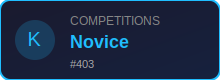
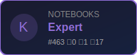

# Hi,I'm Hinata Kaga (samon)

**Robot Engineer & AI/ML Engineer**

---

## About Me

- Working at  RT Company, Samurai AI Inc.
- Based in Tsudanuma, Chiba, Japan
- Passionate about **Robotics**, **ROS2**, and **Machine Learning**

---

## GitHub Stats

  

  
  

  
  

---

## Tech Stack

### Languages

### Robotics & IoT

### AI / ML

### Tools & Platforms

---

## 

  

  

---

## Now Playing on Spotify

